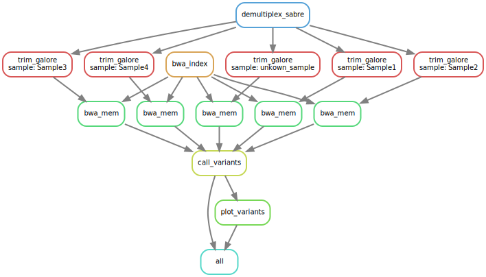

# Dataprocessing Pipeline

This repository contains a Snakemake pipeline for the final assignment of the Data Processing course from the Bioinformatics bachelor program of the [Hanze University of Applied Sciences](https://www.hanze.nl/).

The pipeline performs the following steps:
1. Demultiplexing raw sequencing reads using Sabre
2. Adapter trimming with Trim Galore
3. Read mapping with BWA-MEM
4. Variant calling using Platypus
5. Visualization of variant calling quality scores with a scatterplot generated using ggplot2 in R

## Prerequisites

To run this pipeline, you need to have the following software installed:
- [conda](https://docs.conda.io/en/latest/)
- [Snakemake](https://snakemake.readthedocs.io/en/stable/)

## Installation

1. Clone this repository:
```
git clone https://github.com/yourusername/dataprocessing.git
cd dataprocessing
```


2. Create a conda environment using the provided `environment.yml` file:
```
conda env create -f environment.yml
```


3. Activate the conda environment:
```
conda activate dataprocessing
```

## Configuration

The pipeline is configured using the `config/config.yml` file. Please update the file with your desired paths and settings. The available settings are:

- `data_dir`: Path to the directory containing input data files
- `results_dir`: Path to the directory where results will be stored
- `genome`: Genome file name (must be in `data_dir`)
- `barcode_file`: Barcode file name (must be in `data_dir`)
- `read_name`: Prefix of the read file names
- `consider_already_trimmed`: Minimum length of reads to be considered already trimmed by Trim Galore
- `trim_galore_min_length`: Minimum length of reads to be kept after trimming

## Running the Pipeline

With the conda environment activated, run the Snakemake pipeline:

```
snakemake --cores <number_of_cores>
```


Replace `<number_of_cores>` with the desired number of CPU cores you want to use for running the pipeline.

## Output

The pipeline will generate the following output files in the specified `results_dir`:

- Demultiplexed FASTQ files
- Trimmed FASTQ files
- Mapped BAM files
- Variants VCF file
- Scatterplot of variant calling quality scores (PNG)

## Visualisation of the Directed Acyclic Graph (DAG)

To visualize the workflow as a Directed Acyclic Graph (DAG), run the following command:

```
snakemake --dag | dot -Tsvg > dag.svg
```

This will generate an SVG file called `dag.svg` which can be viewed in an image viewer or web browser.


